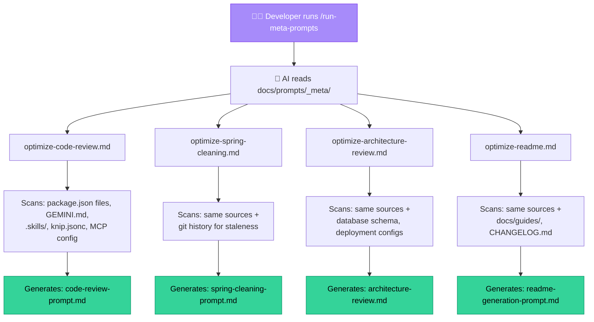
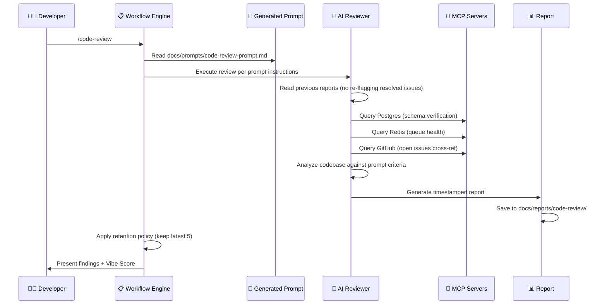
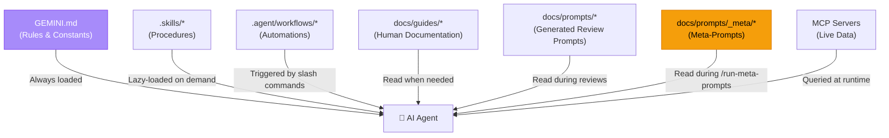
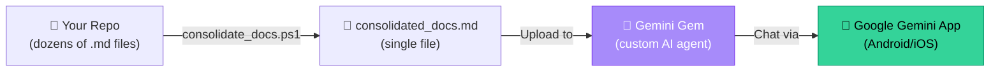

# 🌌 Antigravity 2.0 — Self-Evolving Automated Reviews

Welcome to the **Antigravity 2.0 Self-Evolving Automated Reviews** — a code-free operational review blueprint extracted from my own monorepo. This template packages the complete AI-native development ecosystem: self-optimizing review prompts, modular skill runbooks, automated report orchestration, and the kind of VIBE developer workflow that makes your codebase feel like it's maintaining itself.

No application code lives here. Only the scaffolding, the brain, and the vibes.

---

## 📖 Table of Contents

- [Why This Exists](#why-this-exists)
- [Quick Start (TLDR)](#quick-start-tldr)
- [File and Folder Structure](#file-and-folder-structure)
- [The Meta-Prompting Pipeline](#the-meta-prompting-pipeline-prompts-that-write-prompts)
- [Review Workflow Architecture](#review-workflow-architecture)
- [Modular Skills System](#modular-skills-system)
- [The Dual-Model Implementation Review](#the-dual-model-implementation-review)
- [Report Organization & Retention](#report-organization-retention)
- [Configuration Layer Architecture](#configuration-layer-architecture)
- [Getting Started](#getting-started)
- [Mobile AI Access — Gemini Gems](#mobile-ai-access-gemini-gems)
- [Philosophy](#philosophy)
- [License](#license)

---

## 🎯 Why This Exists

After vibing a new feature into your application most vibers perform some sort of code-complete prompt before committing, like [feature-complete.md](./.agent/workflows/feature-complete.md) in .agent\workflows folder simply by prompting "\feature-complete". The one in this repo updates the repo, writes documentation, updates database diagrams, roadmap, changelog, etc. but what about all the "Vibe-Coding-Artifacts", like the prompts you use for review your code, clean your code, review your architecture and techstack? Are they ready to review and handle the new feature that introduced two new NPM packages downloaded from GitHub and a cloud provider for Facebook login. Probably not.

This REPO solves that by giving Antigravity a **Self-Evolving review flow and updated operational memory of your evolving codebase:**

The result? An AI pair programmer that actually knows your project better than most human team members — and never gets tired of reviewing the code you vibe.

---

## 🎯 Quick start (TLDR)

1. [Download and unzip](https://github.com/ThMoJe/antigravity-self-evolving-reviews/archive/refs/heads/main.zip) into your Antigravity workspace.
2. All files prefixed with `example.` are safe templates — they will **never overwrite your existing files**.
  Rename or merge them as needed (see [Getting Started](#getting-started) for details).
  > [!WARNING]
  > Ensure other files in this template, by coincidence, do not share identical names with your existing files as they could be overwritten.
  - `Recommended:` Have knip installed.
3. In your chat ask Claude Opus 4.6 to `\run-meta-prompts`
  - This will write new tailor made **docs\prompts* `spring-cleaning-prompt.md`, `code-review-prompt.md`, `architecture-review.md`, `readme-generation-prompt.md`.
4. Now ask Claude Sonnet to do Spring cleaning and Code review. Read the reports. There will be sections with stuff to fix and recommendations on what AI to ask to fix the problem.

### If you like, your daily routine will be...

- Use [NEW_feature_template.md](./NEW_feature_template.md) to create draft plan for new feature, re-write, major change
- Use `\implementation-plan-1st-review` and `\implementation-plan-2nd-review` to make the implementation rock solid
  - Have an AI implement according to plan
- Do a `\feature-complete`
- Update your review prompts with `\run-meta-prompts`
- Do `\spring-cleaning`
  - Have the recommended AI fix findings
- Do `\code-review`
  - Have the recommended AI fix findings
- Do `\architecture-review`
  - Have an AI fix stuff or use [NEW_feature_template.md](./NEW_feature_template.md) to plan change, improvement, what ever.
- Do `\update-readme`
- Do another `\feature-complete`
- `...and repeat`

---

## 📂 File and folder Structure

```
antigravity-self-evolving-reviews/
├── example.GEMINI.local.md            # Project rules & AI constitution (rename → GEMINI.md)
├── example.GEMINI.global.md           # Global AI rules template (copy → %USERPROFILE%\.gemini\GEMINI.md)
├── example.package.json               # Workspace manifest template (rename → package.json)
├── example.knip.jsonc                 # Dead-code config template (rename → knip.jsonc)
├── example.gitignore                  # Vibe Coding-optimized gitignore template (rename → .gitignore)
├── example.CHANGELOG.md               # Keep a Changelog starter (rename → CHANGELOG.md)
├── mcp_config.example.json            # MCP server configuration reference
├── consolidate_docs.ps1               # Markdown consolidator for Gemini Gems
├── NEW_feature_template.md            # Implementation plan template for new features
├── LICENSE                            # MIT License
│
├── .skills/                           # Modular AI skill runbooks (Safe to delete)
│   ├── admin-ui-patterns/             #   Admin dashboard patterns
│   ├── capacitor-ops/                 #   Android/Capacitor build & deploy
│   ├── clerk-sync-tracer/             #   Identity/auth sync debugging
│   ├── cyberpunk-ui-crafter/          #   UI theming & micro-animations
│   ├── deployment-ops/                #   Server deployment procedures
│   ├── feed-scraper/                  #   Feed scraping pipeline & extraction
│   ├── project-migrations/              #   Database migration procedures
│   └── security-isolation/            #   Tenant isolation & IDOR prevention
│
├── .agent/
│   └── workflows/                     # Slash-command workflow automations
│       ├── code-review.md             #   /code-review
│       ├── spring-cleaning.md         #   /spring-cleaning
│       ├── architecture-review.md     #   /architecture-review
│       ├── run-meta-prompts.md        #   /run-meta-prompts
│       ├── feature-complete.md        #   /feature-complete
│       ├── config-layer-audit.md      #   /config-layer-audit
│       ├── retention-cleanup.md       #   /retention-cleanup
│       ├── update-readme.md           #   /update-readme
│       ├── implementation-plan-1st-review.md  # Dual-model review (Gemini pass)
│       └── implementation-plan-2nd-review.md  # Dual-model review (Claude pass)
│
├── docs/
│   ├── index.md                       # Documentation hub & navigation
│   ├── guides/
│   │   ├── mcp-server-setup.md        # MCP server configuration guide
│   │   └── vibe-coding-compliance.md  # Spring Cleaning & refactoring guide
│   ├── project/
│   │   ├── roadmap.md                 # Strategic roadmap template
│   │   ├── backlog.md                 # Prioritized backlog template
│   │   └── feature-status.md          # Feature tracking template
│   ├── prompts/
│   │   ├── _meta/                     # 🧠 META-PROMPTS (the source of truth)
│   │   │   ├── optimize-code-review.md
│   │   │   ├── optimize-spring-cleaning.md
│   │   │   ├── optimize-architecture-review.md
│   │   │   └── optimize-readme.md
│   │   ├── code-review-prompt.md      # Generated by meta-prompt (DO NOT EDIT)
│   │   ├── spring-cleaning-prompt.md  # Generated by meta-prompt (DO NOT EDIT)
│   │   ├── architecture-review.md     # Generated by meta-prompt (DO NOT EDIT)
│   │   ├── readme-generation-prompt.md # Generated by meta-prompt (DO NOT EDIT)
│   │   └── known-patterns.md          # Template for intentional pattern docs
│   └── reports/
│       ├── code-review/               # Timestamped code review reports
│       ├── spring-cleaning/           # Timestamped spring cleaning reports
│       ├── architecture-review/       # Timestamped architecture review reports
│       └── archive/                   # Overflow reports (auto-deleted after 90 days)
│
├── client/                            # (Empty) Frontend application workspace
├── server/                            # (Empty) Backend application workspace
└── packages/
    └── types/                         # (Empty) Shared TypeScript types workspace
```

---

## 🧠 The Meta-Prompting Pipeline (Prompts That Write Prompts)

This is the part where things get beautifully recursive.

### The Problem With Static Prompts

Most teams write a code review prompt once and forget about it. Six months later, the prompt still references React 17 when the project upgraded to React 19, still checks for patterns that were refactored away, and has no idea about the three new microservices that were added.

Static prompts rot. They're the comments of the AI world.

### The Solution: Self-Optimizing Knowledge through Evolution (SOKE)

Instead of writing review prompts directly, we write **meta-prompts** — instructions that tell an AI to *analyze the current codebase* and *generate* the actual review prompt from scratch, every time.



### How a Meta-Prompt Works (Step by Step)

Take `optimize-code-review.md` as an example. When the AI executes it, it:

1. **Scans every `package.json**` across all workspaces to extract the real tech stack with exact major versions (e.g., "React 19", "Express 5", "Sequelize 6" — never just "React").
2. **Reads `GEMINI.md**` to understand your project rules, naming conventions, file-size limits, and security policies.
3. **Parses every `.skills/` directory** to learn what domain-specific capabilities exist and instructs the generated prompt to *never flag skill files as dead code*.
4. **Checks `knip.jsonc**` to detect your dead-code analysis configuration and wire it into the review.
5. **Reads MCP server config** to enable live database queries, Redis queue inspection, and GitHub issue cross-referencing during reviews.
6. **Reads all previous review reports** so the generated prompt instructs the reviewer to never re-flag resolved, deferred, or false-positive issues.
7. **Generates a fresh, hyper-specific review prompt** that reflects the *exact current state* of your codebase.

The result: your review prompt is always accurate, always current, and never stale. It's like having a prompt that reads the newspaper every morning.

### The Two-Layer Architecture

```
┌──────────────────────────────────────────────┐
│ docs/prompts/_meta/optimize-*.md             │  ← SOURCE (Edit these)
│ "Analyze the workspace and generate a        │
│  context-aware review prompt."               │
├──────────────────────────────────────────────┤
│ docs/prompts/code-review-prompt.md           │  ← OUTPUT (Never edit directly)
│ "Review this React 19 / Express 5 monorepo   │
│  with Sequelize ORM, 8 skills, 5 MCP..."    │
└──────────────────────────────────────────────┘
```

> ⚠️ **Golden Rule**: Never edit the files in `docs/prompts/` directly. They are *generated outputs*. Edit the meta-prompts in `docs/prompts/_meta/` and run `/run-meta-prompts` to regenerate them.

---

## 📋 Review Workflow Architecture

Reviews aren't ad-hoc activities — they're automated, reproducible workflows triggered by slash commands.

### The Three Review Pillars

| Review                  | Slash Command          | Focus                                                                | Report Location                     |
| ----------------------- | ---------------------- | -------------------------------------------------------------------- | ----------------------------------- |
| **Code Review**         | `/code-review`         | Correctness, security, dead code, God Components, `any` usage        | `docs/reports/code-review/`         |
| **Spring Cleaning**     | `/spring-cleaning`     | Dead code (via Knip), orphaned files, stale dependencies, tech debt  | `docs/reports/spring-cleaning/`     |
| **Architecture Review** | `/architecture-review` | Structural integrity, database schema, deployment topology, MCP data | `docs/reports/architecture-review/` |

### How a Review Workflow Executes

When you type `/code-review`, here's exactly what happens:



### The Recommended Review Sequence

After completing a major feature or code update, run the reviews in this order:

| Order | Review                 | Recommended AI Model             | Rationale                                                                                                                                                   |
| ----- | ---------------------- | -------------------------------- | ----------------------------------------------------------------------------------------------------------------------------------------------------------- |
| 1️⃣   | `/run-meta-prompts`    | **Claude Opus 4.6 (Thinking)**   | Regenerate all prompts first so the review cycle is performed with hyper-specific, up-to-date prompts that reflect the exact current state of your codebase |
| 2️⃣   | `/spring-cleaning`     | **Claude Sonnet 4.6 (Thinking)** | Clean the house first — remove dead code so reviewers don't waste time on ghosts                                                                            |
| 3️⃣   | `/code-review`         | **Claude Sonnet 4.6 (Thinking)** | Review the living code for correctness, security, and compliance                                                                                            |
| 4️⃣   | `/architecture-review` | **Gemini 3.1 Pro (High)**        | Zoom out — verify the structural integrity of the whole system                                                                                              |

It's a virtuous cycle: each review makes the next one better. Your codebase gets smarter over time. It's like compound interest, but for code quality.

---

## 🛠️ Modular Skills System

Skills are the AI's domain-specific knowledge packs. Instead of cramming every procedure into `GEMINI.md` (and blowing up every conversation's context window), skills are **lazy-loaded** — the AI only reads a skill when it needs to perform that specific task.

### Skill Directory Structure

Each skill follows the Antigravity 2.0 standard layout:

```
.skills/
└── skill-name/
    ├── SKILL.md          # Main instruction file (required)
    ├── scripts/          # Helper scripts and utilities
    ├── examples/         # Reference implementations
    └── resources/        # Templates, configs, and assets
```

### Included Skills

> [!CAUTION]
> The Skills here are just sample skills from a production project. They are only included as inspiration and should be deleted and replaced by proper skills for the specific project you are doing.

| Skill                  | Purpose                                       | When the AI Reads It             |
| ---------------------- | --------------------------------------------- | -------------------------------- |
| `admin-ui-patterns`    | Admin dashboard patterns and components       | Building admin interfaces        |
| `capacitor-ops`        | Android builds, APK signing, emulator setup   | Any Android/Capacitor task       |
| `clerk-sync-tracer`    | Identity sync debugging, webhook tracing      | Auth issues or Clerk integration |
| `cyberpunk-ui-crafter` | Theme tokens, micro-animations, design system | UI/UX styling tasks              |
| `deployment-ops`       | Server deployment, Caddy config, CI/CD        | Deployment and infrastructure    |
| `feed-scraper`         | Feed scraping pipeline & extraction           | Content ingestion tasks          |
| `project-migrations`     | Database migration creation & deployment      | Any schema change or migration   |
| `security-isolation`   | Tenant isolation, IDOR prevention, middleware | Security-sensitive operations    |

> 💡 **Key Insight**: Skills are *protected assets*. The review prompts are explicitly instructed to never flag skill files as dead code, unused exports, or console logging violations. They're runbooks, not application code.

---

## 🤝 The Dual-Model Implementation Review

For new feature implementations, this template includes a unique **two-pass review system** that leverages the strengths of different AI models.  
Once you have Antigravity draft your implementation plan and often also a task list then perform Pass 1 and Pass 2 review of the implementation plan and task list:

### Pass 1: The Architect (Gemini)

**Workflow**: `implementation-plan-1st-review.md`

After Claude drafts an implementation plan, Gemini reviews it as the "Principal Architect." Gemini's massive context window lets it cross-reference the entire monorepo simultaneously:

- Identifies missing full-stack requirements (backend endpoints, database migrations, admin UI controls)
- Verifies deployment pipeline compatibility
- Checks for architectural violations (God Components, 10-Second Rule)

### Pass 2: The Pragmatist (Claude)

**Workflow**: `implementation-plan-2nd-review.md`

Claude then reviews Gemini's additions as the "Lead Execution Engineer":

- Applies a **pragmatism filter** to kill scope creep
- Validates technical feasibility across the specific stack
- Sequences tasks for maximum efficiency
- Assigns the optimal AI model and mode for each implementation phase

The result is an implementation plan that's been stress-tested by two fundamentally different reasoning approaches. It's like having a visionary architect *and* a battle-hardened contractor review your blueprints before you break ground.

---

## 📊 Report Organization & Retention

Reports aren't just generated — they're *managed* as living documentation with automated lifecycle policies.

### Retention Policy

| Report Type         | Location                            | Retention            | Overflow Destination    |
| ------------------- | ----------------------------------- | -------------------- | ----------------------- |
| Code Review         | `docs/reports/code-review/`         | Latest **5** reports | `docs/reports/archive/` |
| Spring Cleaning     | `docs/reports/spring-cleaning/`     | Latest **3** reports | `docs/reports/archive/` |
| Architecture Review | `docs/reports/architecture-review/` | Latest **3** reports | `docs/reports/archive/` |
| Archive             | `docs/reports/archive/`             | **90 days**          | Deleted                 |

### Why This Matters

Every review workflow reads **all previous reports** before starting its analysis. This prevents the infuriating cycle of:

1. AI flags issue X
2. You investigate and mark it as "not applicable" or "deferred to backlog"
3. Next review: AI flags issue X again 🤦
4. Repeat forever

With historical report awareness, resolved issues stay resolved. Deferred items stay deferred. The AI learns from its own history — which, frankly, is more than most humans manage.

### Automated Cleanup

The `/retention-cleanup` workflow enforces the retention policy automatically:

- Counts reports in each folder
- Archives reports exceeding the retention limit
- Deletes archived reports older than 90 days
- Reports a summary of what was moved and deleted

---

## 🏗️ Configuration Layer Architecture

One of the hardest problems in AI-assisted development is knowing *where* to put information. This template uses a strict layering system:



### The Decision Matrix

| Question                                                    | If Yes →              |
| ----------------------------------------------------------- | --------------------- |
| Does the AI need this in **every** conversation?            | → `GEMINI.md`         |
| Is this a step-by-step **procedure** for a specific domain? | → `.skills/`          |
| Is this a slash-command **multi-step process**?             | → `.agent/workflows/` |
| Is this explaining a feature for **human onboarding**?      | → `docs/guides/`      |
| Is this **live data** to query at runtime?                  | → MCP Server          |

The `/config-layer-audit` workflow audits this entire structure to detect duplications, misplacements, and stale references across all layers.

---

## 🏁 Getting Started

### 1. Rename the `example.*` Template Files

Before anything else, rename the safe template files that came with the ZIP:

| Template file              | Rename / move to                  | Action                                                   |
| -------------------------- | --------------------------------- | -------------------------------------------------------- |
| `example.GEMINI.local.md`  | `GEMINI.md`                       | Customize project rules extensively (Step 2 below)       |
| `example.GEMINI.global.md` | `%USERPROFILE%\.gemini\GEMINI.md` | Copy to your user profile — applies to all projects      |
| `example.package.json`     | `package.json`                    | Update `name`, `version`, and add your workspaces        |
| `example.knip.jsonc`       | `knip.jsonc`                      | Update workspace entries to match your project structure |
| `example.gitignore`        | `.gitignore`                      | Merge with your existing `.gitignore`                    |
| `example.CHANGELOG.md`     | `CHANGELOG.md`                    | Start your changelog from this template                  |

> [!NOTE]
> These files are prefixed with `example.` precisely so they cannot overwrite your existing project files during a ZIP extract. (Warning: Ensure other files in this template do not, by coincidence, share identical names with your existing files as they could be overwritten). All other files in this template (`.agent/`, `.skills/`, `docs/`, `NEW_feature_template.md`, etc.) are safe to copy directly — they use paths and names that won't conflict with a typical project.

### 2. Merge Into Your Project

Copy the remaining template contents into your project root. If you extracted the ZIP into a subfolder, move the contents up.

> [!WARNING]
> **This template was extracted from a production project (Antigravity-Vibe).** While all personal paths and most project-specific references have been sanitized, a few files intentionally retain Antigravity-Vibe-specific content as **structural examples**:
> - `**docs/reports/**` — The included review reports are real Antigravity-Vibe reports showing the expected report format. They contain absolute file paths and findings specific to that project. They'll be replaced automatically when you run your first `/code-review`, `/spring-cleaning`, or `/architecture-review`.
> - `**docs/prompts/*.md**` (excluding `_meta/`) — The generated review prompts reference Antigravity-Vibe's tech stack. Run `/run-meta-prompts` (step 5 below) to regenerate them for your project.
> - `**.skills/**` — The skill runbooks contain Antigravity-Vibe-specific procedures and examples. Adapt the content to match your domains.
> - `**example.GEMINI.local.md**` — The project rules file is the Antigravity-Vibe constitution. Customize it extensively (step 3 below).
> - `**.agent/workflows/**` — Some workflows reference `project-name` or Antigravity-Vibe by name. Update these references to match your project.

### 3. Customize `GEMINI.md`

This is your first and most important edit. The included `example.GEMINI.local.md` (renamed to `GEMINI.md` in step 1) is from a production project — you'll want to:

- Replace the project name, description, and branding
- Update the tech stack section to match your actual stack
- Adjust the file-size limits, naming conventions, and coding standards
- Update the Critical Files Reference table
- Keep the security standards, error recovery protocol, and Git boundary rules (they're universally good practices)

### 4. Adapt the Skills

Skills are domain-specific, so you'll need to customize them:

- **Keep skills that match your domains** (e.g., `deployment-ops`, `security-isolation`)
- **Delete skills you don't need** (e.g., `feed-scraper` if you're not building a content pipeline)
- **Create new skills** for your unique domains, following the standard directory structure

### 5. Run `/run-meta-prompts`

This is the magic step. The meta-prompts will analyze your *new* codebase and generate review prompts tailored specifically to your project. The included prompts are from the source project — after this run, they'll be *yours*.

### 6. Run Your First Review Cycle

Execute the recommended sequence: `/run-meta-prompts` → `/spring-cleaning` → `/code-review` → `/architecture-review`.

Congratulations — your AI assistant now knows your project intimately. Welcome to Antigravity 2.0. 🌌

---

## 📱 Mobile AI Access — Gemini Gems

One of the most surprisingly powerful workflows in this template has nothing to do with IDE-based development: **asking questions about your entire repo from your phone.**

The included `consolidate_docs.ps1` script merges every `.md` file in your workspace into a single consolidated markdown file. You then upload this file to a **Google Gemini Gem** — a custom AI agent that ingests the document and lets you have natural conversations about your project.

### How It Works



### Setup

1. **Run the consolidator**: `powershell .\consolidate_docs.ps1`
2. **Create a Gemini Gem** at [gemini.google.com](https://gemini.google.com) → Gems → New Gem
3. **Upload `consolidated_docs.md**` as the Gem's knowledge file
4. **Give it a system prompt** like: *"You are an expert on this codebase. Answer questions using the documentation provided."*
5. **Open the Google Gemini app** on your Android phone and select your Gem

### Use Cases

- 🛋️ **Late-night architecture questions**: "How does the subscription sync work?" — answered from the couch
- 🚶 **Walking review**: "What were the findings from the last code review?" — on a morning walk
- 📋 **Quick reference**: "What's the versionCode formula for Android builds?" — before a release
- 🧠 **Onboarding**: Share the Gem with new team members so they can explore the project conversationally

> 💡 **Pro tip**: Set up the `$moveToFolder` variable in `consolidate_docs.ps1` to point to your Google Drive folder. The script will auto-move the consolidated file there, making it instantly available for re-uploading to your Gem after every major update.

It's like having a senior developer who's read every single document in your repo — available 24/7 in your pocket. The vibes truly never sleep. 📱✨

---

## 💭 Philosophy

This template embodies a few core beliefs:

1. **Prompts are code.** They should be version-controlled, tested, and evolved — not scribbled on sticky notes and pasted into chat windows.
2. **AI assistants should have long-term memory.** Not through vector databases and embedding wizardry, but through structured, human-readable documentation that serves both the AI and the human.
3. **Self-optimization beats manual maintenance.** If your prompt can analyze its own codebase and rewrite itself to be more accurate, why would you ever update it by hand?
4. **Delete-biased debugging.** When something breaks, the first hypothesis should be to *remove* code, not add more. This philosophy extends to prompts, skills, and documentation.
5. **The vibes matter.** A codebase that feels clean, organized, and intentional is a codebase that produces better software. And if your AI assistant has a Vibe Score, you'll work harder to keep it high. Gamification isn't just for apps — it's for codebases too.

> *"We don't write code anymore. We write vibes, and the vibes write code."*  
> — Every vibe coder, unironically

---

## 📜 License

This template is extracted from a production monorepo and shared for the benefit of the vibe-coding community. Use it, adapt it, make it yours. If it saves you even one hour of prompt engineering, it was worth it.

Built with 💜 using Google Antigravity 2.0,

---

*Last generated: May 29, 2026 — by an AI that's surprisingly proud of its own documentation.*
