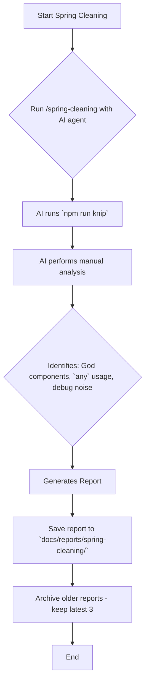

# Developer Tooling & Refactoring Guide

> **Last Updated**: {DATE}
> **Purpose**: Spring Cleaning workflows, VS Code setup, and refactoring patterns for your project.

> **Core coding standards** (TypeScript, file size limits, security, `any` policy) are defined in `GEMINI.md` § Coding Standards.

---

## 🧹 Spring Cleaning & Maintenance

The **Spring Cleaning** workflow (`/spring-cleaning`) systematically identifies and resolves technical debt.

### Tooling: Knip
*   **Purpose**: Primary automated tool for detecting dead code and unused dependencies.
*   **Run**: `npm run knip`
*   **Config**: `knip.jsonc` at workspace root handles known exceptions.
*   **Detection**: Unused files, unused/unlisted dependencies, unused/duplicate exports, unused types.

### Running Spring Cleaning



### NPM Package Updates
1.  Review outdated packages: `npm outdated --workspaces`
2.  Safely update Patch and Minor versions: `npm update <package-name> -w <workspace>`
3.  Build and verify: `npm run build --workspaces`

---

## 🛠️ Recommended VS Code Extensions

| Extension | ID | Purpose |
|:----------|:---|:--------|
| **Better Comments Next** | `jeff-hykin.better-comment-next` | Color-coded comments (`// TODO:`, `// !`, `// ?`) |
| **Document This** | `oouo.docthis` | Auto-generate JSDoc for functions |
| **Error Lens** | `usernamehw.errorlens` | Inline error display |
| **TODO Highlight** | `wayou.vscode-todo-highlight` | Track dev notes and tech debt visually |

**Comment Conventions**:
*   `// TODO:` — tasks to complete later.
*   `// !` — important warnings or gotchas.
*   `// ?` — questions or areas needing review.
*   `// TODO (AI)` — tasks intended for AI handling.

---

## 🏗️ Refactoring Patterns

> **Threshold**: See `GEMINI.md` → File Size Zones for the 450/475/500 line zones.

When files exceed 500 lines, extract responsibilities incrementally:

### Backend Services
*   **Extract Query Builders**: Complex WHERE clause construction → dedicated utilities (e.g., `server/utils/archiveQueryBuilder.ts`).
*   **Extract Sub-Services**: Separate distinct responsibilities (e.g., `server/services/ArchiveRestorationService.ts`).
*   **Keep Core Logic**: Main service orchestrates but delegates heavy lifting.

### Frontend Components
*   **Extract UI Sections/Tabs**: Each tab or distinct UI block → its own component.
*   **Extract Logic to Hooks**: Data fetching, filtering, validation → custom hooks (e.g., `useAddFeedValidation.ts`).
*   **Keep Shell**: Main component handles routing and state coordination.

### File Organization
*   **Hooks**: `use` prefix (e.g., `useUserManagement`).
*   **Components**: PascalCase (e.g., `UserTableFilters`).
*   **Files**: Match component/hook name exactly. Co-locate sub-components in a matching directory.

### Verification Queries
```powershell
# Find files exceeding 500 lines
Get-ChildItem -Recurse -Include *.ts,*.tsx | Where-Object {
  (Get-Content $_.FullName | Measure-Object -Line).Lines -gt 500
}

# Find 'as any' usage
Select-String -Path "server\**\*.ts" -Pattern "as any"
```